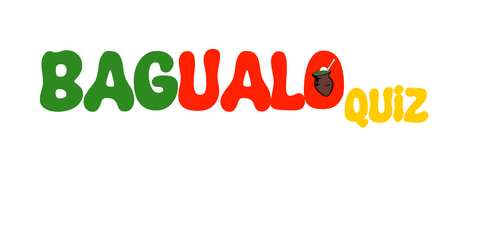

# BagualoQuiz

O **BagualoQuiz** é um jogo criado para a disciplina de Paradigmas de Programação, usando o framework libGDX. O objetivo do jogo é trazer questões sobre os Geoparques da Quarta Colônia, promovendo a cultura e conhecimento. A mecânica do jogo foi inspirada em  <a href="https://wordwall.net/resource/77367/english/riddles-in-the-sky">*Riddles in The Sky*</a>.

Para jogar, é necessário utilizar somente o mouse ou touchpad. O jogo é um quiz de 12 perguntas. O personagem principal é o bagualosauro pilchado, e o objetivo dele é acertar o máximo de perguntas possíveis, sem perder as 3 vidas, para acumular pontos.

 

### FONTES E REFERÊNCIAS

**Logo do Jogo**: <a href="https://github.com/rafaelarosasoares">Rafaela da Rosa Soares. </a> 

**Fonte da Logo**: <a href="https://www.dafont.com/super-funtime.font"> SuperFun Time.

**Imagem de Vitória**: <a href="https://github.com/rafaelarosasoares">Rafaela da Rosa Soares. </a>

**Imagem de Perda**: <a href="https://github.com/rafaelarosasoares">Rafaela da Rosa Soares. </a>

**Som de Acerto**: <a href="https://www.youtube.com/watch?v=ZvlvhIpcflA"> DeeChanel </a>

**Som de Erro**: <a href="https://www.youtube.com/watch?v=qeZpgFzmcDI"> Zansalad </a>

**Música do Jogo**: <a href="https://www.youtube.com/watch?v=PVY0nUbdIYk"> Teclas Master Tutorial </a>

**Ilustração de Agudo**: <a href="https://scontent.fcxj1-1.fna.fbcdn.net/v/t1.6435-9/121559642_1761168760703818_1421079024171080650_n.jpg?_nc_cat=108&ccb=1-7&_nc_sid=2be8e3&_nc_ohc=tYZ5FPWTymYAX_y4aqu&_nc_oc=AQmZ9YyIVtA5THWnrmorCBtHctgcRSWsInuUTQGzCGWdHmyjHh5uSGlwr5DC6usYzrs&_nc_ht=scontent.fcxj1-1.fna&oh=00_AfCJM0hAdH832_ECOtnxfK2xwaLV-iOU_3jihw9JMkLW2g&oe=6590032D"> Dilson Cecchin </a>

**Imagem do Bagualosaurus**: <a href="https://diariosm.com.br/noticias/geral/conheca_o_dinossauro_mais_bagual_do_estado_fossil_foi_encontrado_na_regiao_central.523998"> Diário de Santa Maria. </a>

**CAMPOS, Mateus.** Biomas. **Mundo Educação.** Disponível em: <a href=https://mundoeducacao.uol.com.br/geografia/biomas.htm> https://mundoeducacao.uol.com.br/geografia/biomas.htm </a>

Pontos Turísticos. **Prefeitura de Ivorá**. Disponível em: <a href="https://www.ivora.rs.gov.br/turismo/pontos-turisticos"> https://www.ivora.rs.gov.br/turismo/pontos-turisticos </a>

Berço Nacional dos Dinossauros. **Prefeitura de Agudo**. Disponível em: <a href="https://www.agudo.rs.gov.br/pagina/berco-nacional-dos-dinossauros"> https://www.agudo.rs.gov.br/pagina/berco-nacional-dos-dinossauros. </a>

**BIERNATH, André**. As fascinantes histórias de 7 dinossauros encontrados no Brasil. **BBC News Brasil**. Disponível em: <a href="https://www.bbc.com/portuguese/articles/c4nz8dlzmppo"> https://www.bbc.com/portuguese/articles/c4nz8dlzmppo </a>

**SOUSA, Rafaela.** Planaltos. **Mundo Educação**. Disponível em: <a href="https://mundoeducacao.uol.com.br/geografia/planaltos.htm"> https://mundoeducacao.uol.com.br/geografia/planaltos.htm </a>

**Museu WEG**. Conheça 5 dinossauros do Brasil. **Museu WEG**. Disponível em: <a href="https://museuweg.net/blog/dinossauros-do-brasil/"> https://museuweg.net/blog/dinossauros-do-brasil/ </a>

Sítio Paleontológico de Agudo. **Prefeitura de Agudo**. Disponível em: <a href="https://www.geoparquequartacolonia.com.br/81/ver/geossitios/sitios-paleontologicos/agudo"> https://www.geoparquequartacolonia.com.br/81/ver/geossitios/sitios-paleontologicos/agudo </a>

Geoparque Quarta Colônia Mundial UNESCO. **UFSM**. Disponível em: <a href="https://www.ufsm.br/pro-reitorias/pre/geoparque-quarta-colonia"> https://www.ufsm.br/pro-reitorias/pre/geoparque-quarta-colonia </a>

